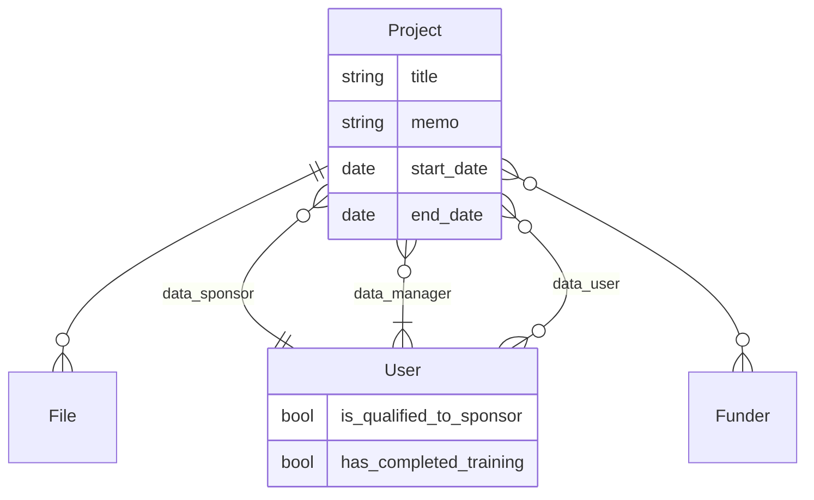
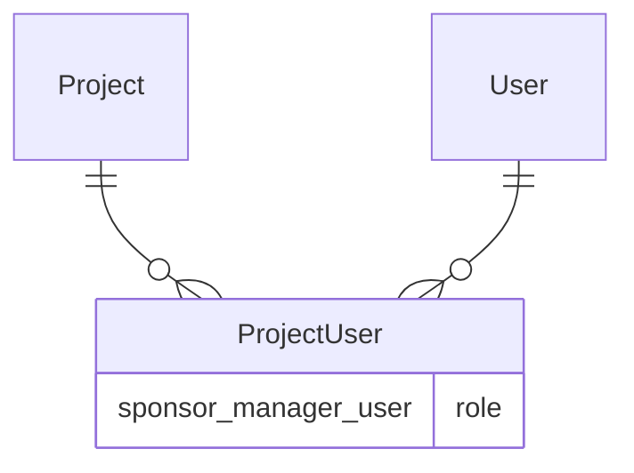

# tiger-data-app
TigerData is a comprehensive set of data storage and management tools and services that provides storage capacity, reliability, functionality, and performance to meet the needs of a rapidly changing research landscape and to enable new opportunities for leveraging the power of institutional data. 

## Documentation

We're writing a ["Missing Manual"](docs/) for the subset of Mediaflux that is used by TigerData.

## Structure

These are our initial plans: In the eventual implementation different systems (Mediaflux, Postgres, LDAP) may have responsibility for different bits of data.

This logical structure should not be taken as dictating the implementation.
In particular, the relationships between `Projects` and `Users` might be better implemented as a single
many-to-many relationship, with the cardinality constraints implemented in ruby rather than in the database itself.

## Local development

### Setup
1. Check out code and `cd`
1. Install tool dependencies
    1. [Lando](https://docs.lando.dev/getting-started/installation.html)
    1. [asdf](https://asdf-vm.com/guide/getting-started.html#_2-download-asdf)
1. Install asdf dependencies
    1. `asdf plugin add ruby`
    1. `asdf plugin add node`
    1. `asdf plugin add yarn`
    1. `asdf install`
    1. ... but because asdf is not a dependency manager, if there are errors, you may need to install other dependencies. For example: `brew install gpg`
1. Install language-specific dependencies
    1. `bundle install`
    1. `yarn install`

### Starting / stopping services
We use lando to run services required for both test and development environments.

Start and initialize database services with:

`bundle exec rake servers:start`

To stop database services:

`bundle exec rake servers:stop` or `lando stop`

### Running tests
1. Fast: `bundle exec rspec spec`
2. Run in browser: `RUN_IN_BROWSER=true bundle exec rspec spec`

### Starting the development server
1. `bundle exec rails s -p 3000`
2. Access application at [http://localhost:3000/](http://localhost:3000/)
