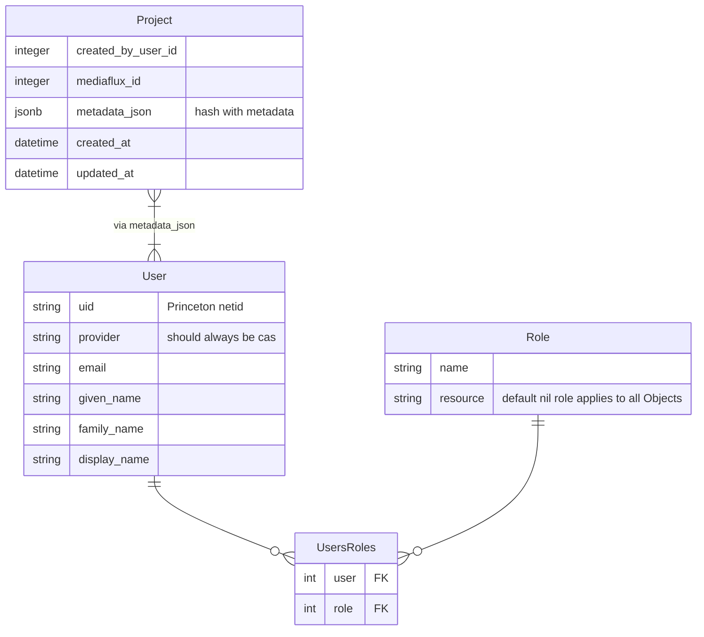
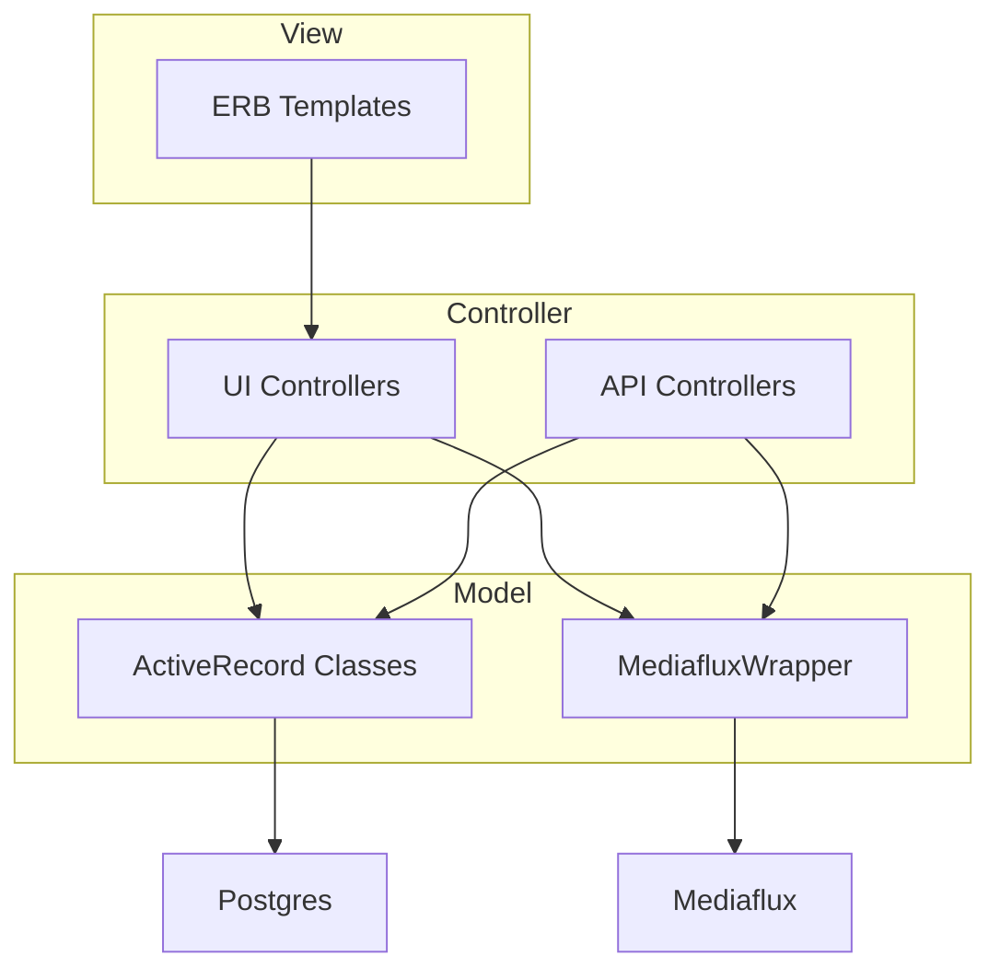

# tiger-data-app

TigerData is a comprehensive set of data storage and management tools and services that provides storage capacity, reliability, functionality, and performance to meet the needs of a rapidly changing research landscape and to enable new opportunities for leveraging the power of institutional data.

This application provides a front end for users to create and manage projects that live in the TidgerData infrastructure.

[](https://circleci.com/gh/pulibrary/tiger-data-app/tree/main)
[](https://coveralls.io/github/pulibrary/tiger-data-app?branch=main)

## Documentation

- Design documents and meeting notes are in [Google Drive](https://drive.google.com/drive/u/1/folders/0AJ7rJ2akICY2Uk9PVA)
- RDSS internal notes are in a [separate directory](https://drive.google.com/drive/u/1/folders/1kG6oJBnGqOUdM2cHKPxCOC9fBmAJ7iDo)
- A set of requirements derived from early sketches is [here](https://docs.google.com/document/d/1U06FBX0qR9iMNiWes5YhP0schcPiLTmFwjHurduSb3A/edit).
- We're writing a ["Missing Manual"](docs/) for the subset of Mediaflux that is used by TigerData.

## Structure

These are our initial plans: In the eventual implementation different systems
(Mediaflux, Postgres, LDAP) may have responsibility for different bits of data.
Cardinality constraints (projects must have sponsors, etc.) will be enforced in software.


### Roles
The system will eventually have many roles.  Please refer to the [docs for a description](https://github.com/pulibrary/tiger-data-app/blob/main/docs/roles.md) of the system roles

### API Plans
Controllers may rely either on ActiveRecord models, or the `MediafluxWrapper` class.



## Local development

### Setup

1. Check out code and `cd`
1. Install tool dependencies; If you've worked on other PUL projects they will already be installed.
    1. [Lando](https://docs.lando.dev/getting-started/installation.html)
    1. [asdf](https://asdf-vm.com/guide/getting-started.html#_2-download-asdf)
    1. postgres (`brew install postgresql`: Postgres runs inside a Docker container, managed by Lando, but the `pg` gem still needs a local Postgres library to install successfully.)
1. Install asdf dependencies with asdf
    1. `asdf plugin add ruby`
    1. `asdf plugin add node`
    1. `asdf plugin add yarn`
    1. `asdf plugin add java`
    1. `asdf install`
    1. ... but because asdf is not a dependency manager, if there are errors, you may need to install other dependencies. For example: `brew install gpg`
1. OR - Install dependencies with brew and chruby
   1. `ruby-install 3.1.3 -- --with-openssl-dir=$(brew --prefix openssl@1.1)`
   2. close the terminal window and open a new terminal
   3. `chruby 3.1.3`
   4. `ruby --version`
1. Install language-specific dependencies
    1. `bundle install`
    2. `yarn install`

On a Mac with an M1 chip, `bundle install` may fail. [This suggestion](https://stackoverflow.com/questions/74196882/cannot-install-jekyll-eventmachine-on-m1-mac) helped:
```
gem install eventmachine -v '1.2.7' -- --with-openssl-dir=$(brew --prefix libressl)
brew install pkg-config
bundle install
```

### Starting / stopping services

We use lando to run services required for both test and development environments.

Start and initialize database services with:

`bundle exec rake servers:start`

To stop database services:

`bundle exec rake servers:stop` or `lando stop`

You will also want to run the vite development server:

`bin/vite dev`

#### MediaFlux Server

Documentation for starting the mediaflux server can be found at [doc/local_development](https://github.com/pulibrary/tiger-data-app/blob/main/docs/local_development.md)

1. Once mediaflux is running locally
  1. `bundle exec rake schema:create`

##### Authentication

By default, there exists for the MediaFlux deployment a user account with the following credentials:

- domain: `system`
- user: `manager`
- password: `change_me`

Alternatively, one may please use `docker/bin/shell` to create a terminal session within the container and find individual accounts within the file `/setup/config/users.json`.

##### aterm Client

The MediaFlux `aterm` may be accessed using http://0.0.0.0:8888/aterm/

##### Desktop Client

The MediaFlux desktop client may be accessed using http://0.0.0.0:8888/desktop/

##### Thick Client

One may start and access the Thick Client using the Java Virtual Machine with the following steps:

```bash
$ docker/bin/start
# Within another terminal session, please invoke:
$ docker cp mediaflux:/usr/local/mediaflux/bin/aterm.jar ~/aterm.jar
$ java -Xmx4g -Djava.net.preferIPv4Stack=true -jar ~/aterm.jar
```

###### Configuration Commands

```bash
> server.identity.set :name carolyn
> display font-size 18
> display prompt   "carolyn > "
> display save
```

##### Service Documentation

The MediaFlux service documentation may be accessed using http://0.0.0.0.:8888/mflux/service-docs/


### Running tests

- Fast: `bundle exec rspec spec`
- Run in browser: `RUN_IN_BROWSER=true bundle exec rspec spec`

### Add Yourself as a Project Sponsor

1. Edit config/default_sponsors.yml
   1. Add your netid in each section
2. Edit config/default_mediaflux_admins.yml
   1. Add your netid in each section
3. Run the rake task to update the config file
   1. `bundle exec rake roles:default_sponsors`
   2. `bundle exec rake roles:default_mediaflux_admins`

### Starting the development server

1. `bundle exec rails s -p 3000`
2. Access application at [http://localhost:3000/](http://localhost:3000/)

## Production and Staging Deployment
Deploy with Capistrano (we are intending to have a deployment mechanism with Ansible Tower, but that is not yet implemented)
```bundle exec cap production deploy```
or
```bundle exec cap staging deploy```

