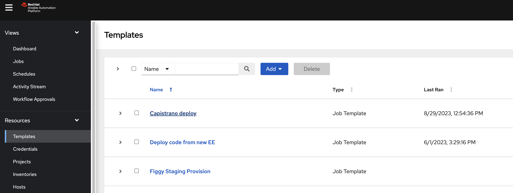
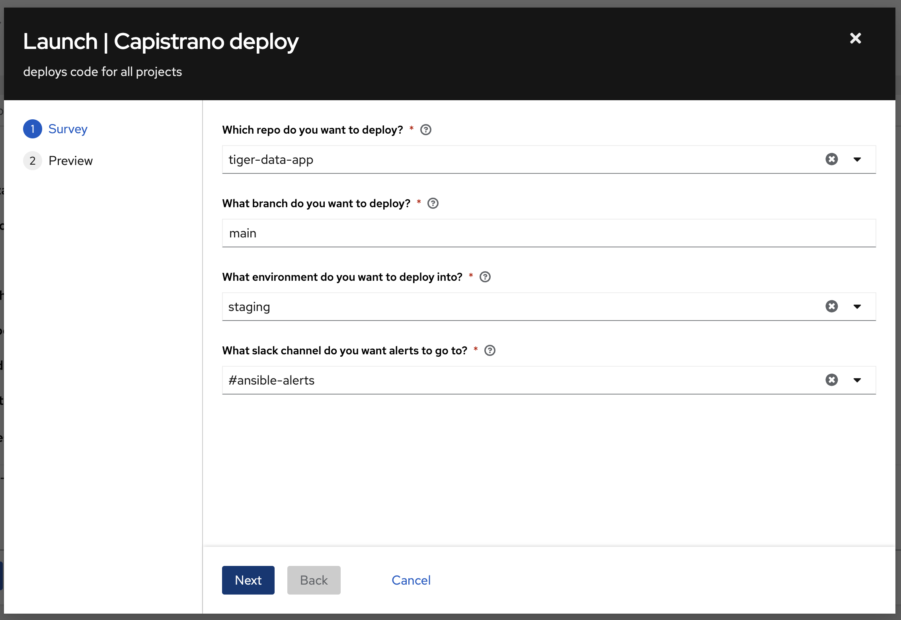
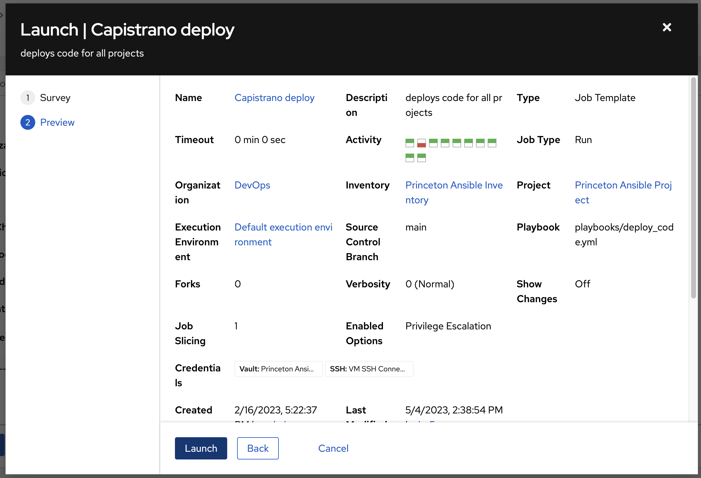

# Deploying TigerData

## Capistrano
Currently TigerData uses the [Capistrano](https://rubygems.org/gems/capistrano) Ruby Gem in order to automate the deployment of the application into server environments. While normally this process is automated using `Ansible Tower`, one may deploy the application manually by invoking the following:

```bash
$ bundle exec cap staging deploy
```

## Ansible Tower
The preferred approach for deploying `TigerData` is the usage of the Princeton University Library [Ansible Tower](https://ansible-tower.princeton.edu/) instance in order to request a new deployment of the application into a specific environment. In order to deploy the application, please find the following steps:





For more guidance and information regarding the deployment of RDSS applications using Tower, please refer to [the "Deployment" section of the PUL IT Handbook](https://github.com/pulibrary/pul-it-handbook/blob/main/services/deployment.md).
