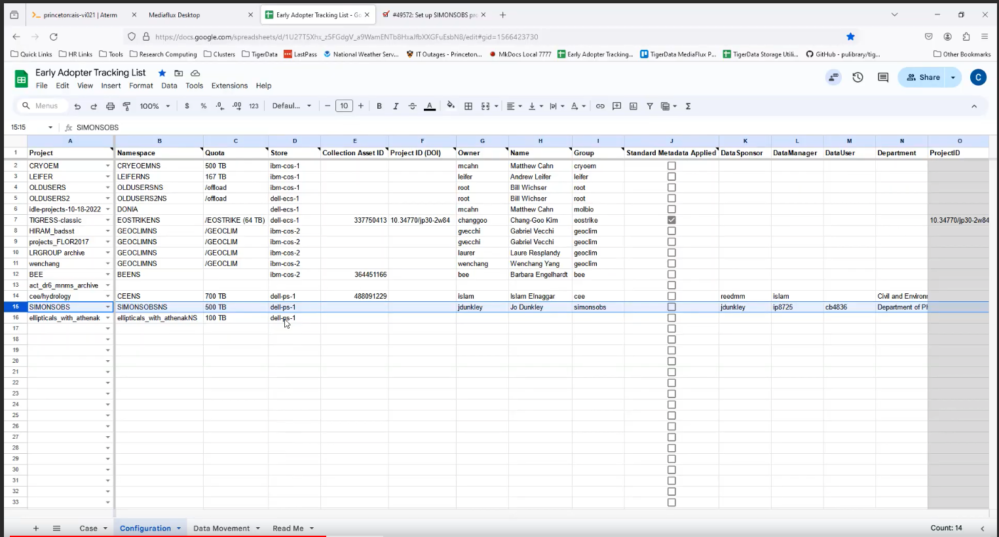
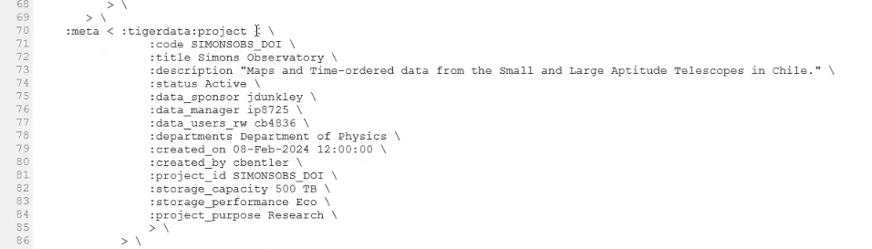

# How Chuck creates a project in aterm
This is a written summary of Chuck's video, which is available here: https://drive.google.com/file/d/1fYGNkVM9J94J1jUmZ7p0MZEUX2meLZav/view

## Steps
### 1. Create a namespace for the project
Within the tiger data namespace, create a namespace for this project:
```
asset.namespace.create :namespace /princeton/tigerdataNS/SIMONSOBSNS :store dell-ps-q
```

Questions: 
1. How do we know what store to give it?
2. Chuck copies the namespace id that mediaflux creates. Do we need to store that somewhere?

### 2. Create the collection for the project
```
ccd tigerdata # navigate to the tigerdata collection
asset.create :name SIMONSOBS \
  :namespace princeton/tigerdataNS/SIMONSOBSNS \
  :collection \
    -unique-name-index true \
    -cascade-contained-asset-index true \
    -contained-asset-index true \
    true \ 
 :owner < :domain princeton :user jdunkley > \
 :member-acl < \
  :actor -type user princeton:jdunkley \
  :access < \
    :asset ACCESS \
    :asset CREATE \
    :asset MODIFY \
    :asset DESTROY \
    :collection ACCESS \
    :collection EXECUTE \
    :collection CREATE \
    :collection MODIFY \
    :collection DESTROY \
    :asset-content ACCESS \
    :asset-content MODIFY \
    :asset-content EXECUTE \
    > \
  :member-acl < \
    :actor -type user princeton:ip8725 \
    :access < \
      :asset ACCESS \
      :asset CREATE \
      :asset MODIFY \
      :asset DESTROY \
      :collection ACCESS \
      :collection EXECUTE \
      :collection CREATE \
      :collection MODIFY \
      :collection DESTROY \
      :asset-content ACCESS \
      :asset-content MODIFY \
      :asset-content EXECUTE \
      > \
   > \
  :member-acl < \
    :actor -type role pu-hpc-group:simonsobs \
    :access < \
      :asset ACCESS \
      :collection ACCESS \
      :collection EXECUTE \
      :asset-content ACCESS \
      :asset-content EXECUTE \
      > \
   > \
   :quota < :allocation 500 TB \
    :on-overflow fail \
    :description "Initial Quota" \
    > \
    :pid "path=/princeton/tigerdata"

    >>
```
Timestamp 5:47

Questions:
1. The rest of the above script is not visible on the video. Can we get the rest of it?
2. Chuck is recording the collection asset id into his spreadsheet. Do we need to record that anywhere? 
3. In Chuck's workflow, the "requested quota" and "allocated quota" are the same. But we want those to be two separate fields, right? Because we might now allocate everything they're requesting right away. 
4. Some projects (e.g., the Simons Observatory) have an ongoing request for storage that seems unending. Is that use case captured by our current data model of a single "requested quota" and "currently allocated" quota? 
5. QUESTION: In the video Chuck says "there is no DOI yet." When does that get created? When should it be created in our workflow? 
6. NOTE: The "owner" of the collection must be specified or on the unix filesystem it will be owned by root. This should be the data sponsor.
7. The example email from the Simons Observatory, there are multiple people named as Data Managers. However, our current UI only allows for one Data Manager. (Matt Chandler answered: Regardless of what Chuck is doing in email, our system will only allow one data manager.)
8. QUESTION: How is the group `pu-hpc-group:simonsobs` created? Is that a pre-existing unix group in HPC? 
9. Chuck says we could be setting metadata at project creation time, but he isn't doing that because he doesn't have a DOI yet.
10. pid == "parent id" -- the tiger data collection
11. 

Chuck tracks each early adopter in this tracking sheet, which roughly matches his process for getting them set up in MediaFlux (timestamp 6:04):



Here is an example of adding metadata at project creation time (note that the schema is out of date):



Metadata can be updated at any time, but best to get as much as possible in during project creation, because metadata is versioned on assets and "it could get complicated" if we're doing lots and lots of updates.

### 3. Adding an accumulator 
~ timestamp 17:06
Some outstanding questions about how accumulators work. Possible to use top-level accumulators 

```
asset.collection.accumulator.add :id path=/princeton/tigerdata/SIMONSOBS :accumulator < :name SIMONSOBS-count :type collection.asset.count >
```