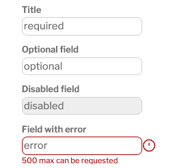

# Form field styles

Form fields have standardized styles for required fields, optional fields, disabled fields, and fields displaying an error.

## How to use these styles

* Each textfield should be contained within a div with the class `form-field-container` applied.
* Required fields should have the `required-field` class applied to the textfield.
* Optional fields should have the `optional-field` class applied to the textfield.
* Disabled fields should have the `disabled-field` class, and the attribute `disabled: true` also applied to the textfield.
* Fields with an error should have the `error-field` class applied to the textfield, should be contained within a div with the classes `form-field-container error-field-container` applied, and should have a div with the class `error-field-message` containing the text of the error message directly underneath the textfield with the error.


## Example HTML

Here is an example of how the field styles are applicable to view partials:

```rails 
<div>

   <div class="form-field-container">
      <%= form.label :title %>
      <%= form.text_field :request_title, class: "required-field", required: true, placeholder: "required" %>
   </div>

   <div class="form-field-container">
      <%= form.label :optional_field %>
      <%= form.text_field :request_title, class: "optional-field", placeholder: "optional" %>
   </div>

   <div class="form-field-container">
      <%= form.label :disabled_field %>
      <%= form.text_field :request_title, class: "disabled-field", disabled: true, placeholder: "disabled" %>
   </div>

   <div class="form-field-container error-field-container">
      <%= form.label :field_with_error %>
      <%= form.text_field :request_title, class: "error-field", placeholder: "error"%>
      <div class="error-field-message">500GB max can be requested</div>
   </div>

</div>
```

Here is what the example looks like when rendered in a browser: 



