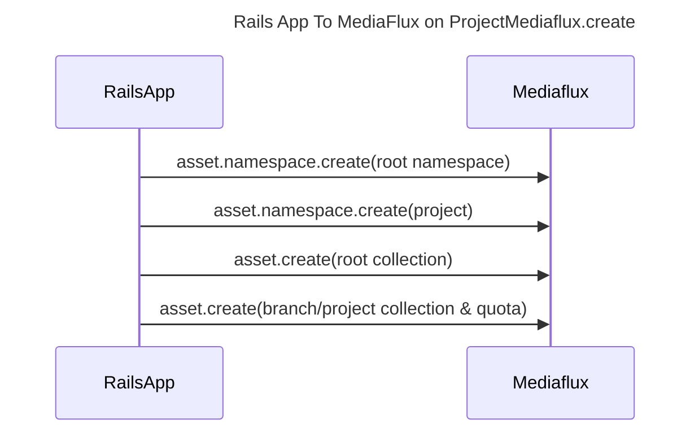

# Calls to Mediaflux Made during ProjectMediaflux.create!

```mermaid
sequenceDiagram
  title Rails App To MediaFlux on ProjectMediaflux.create

  RailsApp->>Mediaflux: asset.namespace.create(root namespace)
  RailsApp->>Mediaflux: asset.namespace.create(project)
  RailsApp->>Mediaflux: asset.create(root collection)
  RailsApp->>Mediaflux: asset.create(branch/project collection & quota)

```
